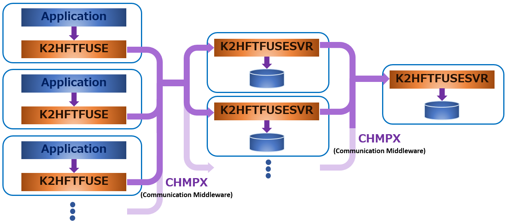

# Feature

## Flexible installation
We provide suitable K2HFTFUSE installation for your OS. If you use Ubuntu, CentOS, Fedora or Debian, you can easily install it from [packagecloud.io] (https://packagecloud.io/antpickax/stable). Even if you use none of them, you can use it by [Build] (https://k2hftfuse.antpick.ax/build.html) by yourself.

## Source and Destination Components
Connection management between the transfer source and transfer destination is managed by CHMPX as described above.  
CHMPX is communication middleware that provides connections between hosts using Socket and provides transparent communication between programs on the host.  
K2HFTFUSE connects as follows(as an example).

K2HFTFUSE transfers the data to be transferred to the transfer destination according to the connection.  
And it can be transferred to any single host, a specific host, all hosts(broadcast).  
These are provided by CHMPX.  
If the destination host fails and can not send data, it can be automatically transferred to the secondary host.  
Therefore, K2HFTFUSE can transfer instantaneously and make it strong against failure tolerance.

## Multistage transfer
K2HFTFUSE can transfer not only one stage but also multiple stages.

By using a multistage structure, it is possible to further aggregate data aggregated at each colo(data center).

## Reliability
Data integrity and reliability are described below.

When K2HFTFUSE is written at the transfer source, data is queued once to K2HASH on the local system.  
Queued data is immediately sent to the transfer destination by CHMPX if the communication status is normal.  
If it can not communicate with the transfer destination host, transfer of the queued data is restarted when communication is restored.

If the mount point by K2HFTFUSE is unmounted, it will be output to the local file below the mount point.  
By preparing the output file in advance below the mount point you can also correspond at umount.  
You can send this local file manually before re-mount by K2HFTFUSE.

## Custom Processing
You can simply transfer files and messages using K2HFTFUSE.  
You may want to add your own processing or modifying before and after the transfer.  
K2HFTFUSE can output to a local file on sender host, relay host, destination host, and can call and process an external plug-in program.

You can make these settings in the configuration of K2HFTFUSE and K2HFTFUSESVR.  
For example, K2HFTFUSE can start an external program and process the written data.

External programs started as plug-ins are connected with K2HFTFUSE or K2HFTFUSESVR with stdin by PIPE.  
If you are concerned about performance, you can create a program like K2HFTFUSESVR.  
In that case, you can refer to the source code [k2hftfusesvr.cc]({{ site.github.repository_url }}/blob/master/src/k2hftfusesvr.cc).

## Filtering and Attributes
If you transfer data, you will want to filter the transfer.  
For filtering, transfer only when matching to a specific character string, or not want to transfer specific data only.  
You can configure filtering in the configuration of K2HFTFUSE.

Also, when aggregating data from multiple transfer sources, you may need to know from what host, when data is written.  
The data transferred by K2HFTFUSE includes attributes which are the transfer source host name, process(thread) ID, and time at wringing.  
After receiving the data on the transfer destination host you can decide what to use the attached information and how to process the attached information.

# About Performance
The following is the result of a simple performance measurement.

We measured the performance with 4 VM as the transfer source host and 1 VM as the transfer destination host.  
Each host is a virtual machine of 2 core CPU * 4GB memory, and it is provided by Hypervisor(Xeon E5-2650L v3 1.80GHz(24 cores, 48 threads) / 503GB / 300GB RAID-1).

On the transfer source the program writes to the file (file under the mount point of K2HFTFUSE), and K2HFTFUSESVR outputs all the data received on the transfer destination host to the local file(ext4).  
The data to be transferred is a text file, and we tried several bytes per line.

| Data length per line(bytes) | (lines / second) |
|:-----------|------------:|
| 4096   | 20766        |
| 1024   | 158112       |
| 128    | 292382       |
| 10     | 475638       |

In the case of 1 row 4 KB, the transfer rate of 20,000 lines/sec has been measured.  
In the case of 1 line of 10 bytes, the transfer rate was about 500,000 lines/sec.  
The network of the test environment is 1 Gbps, and it seems that the network of the test environment is the upper limit.  

## Performance measurement result
The results of the detailed measurement of the performance of K2HFTFUSE are summarized [**here(Performance)**](performance.html).
