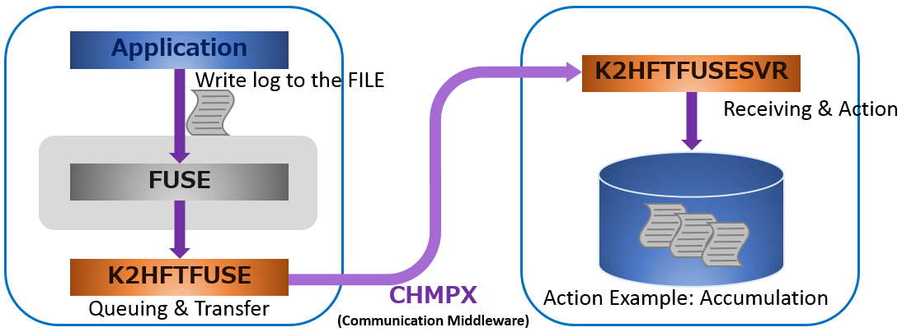

# 特徴

## 柔軟なインストール
K2HFTFUSEは、あなたのOSに応じて、柔軟にインストールが可能です。あなたのOSが、Ubuntu、CentOS、Fedora、Debianなら、[packagecloud.io](https://packagecloud.io/antpickax/stable)からソースコードをビルドすることなく、簡単にインストールできます。それ以外のOSであっても、自身で[ビルド](https://k2hftfuse.antpick.ax/buildja.html)して使うことができます。

## 転送元/転送先の構成
転送元と転送先の構成は、上述したとおりCHMPXというプログラムに任せています。  
簡単な説明として、このCHMPXはSocketによるサーバー間の常時接続を提供し、サーバー上のプログラム同士の透過的なコミュニケーションを提供する通信ミドルウエアです。  
K2HFTFUSEは、このCHMPXを利用することにより、転送元、転送先のサーバー接続構成を構築しています。  
K2HFTFUSEでは、以下のような接続を提供します。

転送先サーバーを複数とした場合には、転送するデータを、1台のみに、または同報転送として全台に転送することが可能です（この機能はCHMPXの提供する機能です）。  
また、1台のみに転送する場合であっても、転送先サーバーと通信できない（障害などで）ケースでは、自動的に補助サーバーに転送もできます。  
これにより即時性を失わず、転送を継続することができ、障害耐性にも強い構成を作ることができます。

## 多段転送
K2HFTFUSEは、上記のように1段の転送のみではなく、多段の転送もできます。

多段に組むことにより、各コロ（データセンターなど）で集約したデータをさらに集約するような用途にも利用できます。

## データの保全
テータの転送を行うときに、利用者が気になるデータの保全について説明します。  
K2HFTFUSEでは、転送元でデータを書き込んだときに（FUSEでマウントしたディレクトリ以下のファイルへの書き込み）、いったんローカルシステム上のK2HASHにデータがキューイングされます。  
キューイングされたデータは、通信状況が正常であれば、CHMPXにより転送先に送り出されます。  
この処理におけるタイムラグはほとんどなく通信状況が正常であれば瞬時に行われます。  
障害などで通信できない状況の場合には、キューイングされ、通信状況が回復した時点で転送が再開されます。  

もし、K2HFTFUSEのマウントが外れた場合には、あらかじめマウント時にマウントポイント以下にディレクトリを準備しておくなどすることでローカルファイルとしてK2HFTFUSE導入前と同じようにローカルファイルに出力されます。  
K2HFTFUSEを再マウントする前にこのファイルを転送することで再開も可能です（この場合オペレーションは必要です）。

## 独自処理の組み込み
K2HFTFUSEを利用する上で、提供されているプログラムで基本的なファイル/メッセージの転送ができます。  
しかし、用途によっては独自の処理を加えたい場合、ひとつの転送元から多種のデータを転送したい場合など、カスタマイズを加えたいケースがあります。

K2HFTFUSEでは、送信元、中継時、送信先でローカルファイルへの出力を行ったり、外部のプラグインプログラムに処理をさせることができます。

これらは、K2HFTFUSEおよびK2HFTFUSESVRの設定ファイルで詳細に指定できます。  
外部のプログラムをプラグインとして起動し、受け取ったデータを引き渡すことができ、これにより独自の処理を行うことができます。

外部のプログラムとK2HFTFUSEおよびK2HFTFUSESVRは、標準入出力をPIPEで接続しているため、パフォーマンスに不安のある場合には、K2HFTFUSESVR自体を自作できます。  
ソースコード[k2hftfusesvr.cc]({{ site.github.repository_url }}/blob/master/src/k2hftfusesvr.cc)を参考にして作成できます。    
こちらについては、次回以降でサンプルプログラムなど説明できればと思います。

## データのフィルターと加工について
データを転送する場合、特定の文字列にマッチングした場合のみ転送したい、特定のデータだけを転送したくないなどのケースが存在します。  
これらは、転送元のK2HFTFUSEの設定にて指定することができ、データのフィルタリングを提供しています。

また、複数の転送元からデータの集約を行う場合、どのサーバーから、何時作成されたデータなのか必要となる場合があります。  
K2HFTFUSEでは、デフォルトで、転送元サーバー、データを書き込んだプロセスID、データの書き込まれた時刻等々のデータに付随する情報も一緒に転送されています。  
転送先でデータを受信後に、どの付属情報を利用するか、どのように加工するかなどの設定もできます。

# パフォーマンス
転送元ホストを4台（VM）、転送先ホストを1台（VM）として、それぞれ 2CPU（core） / 4GB memory のスペックでK2HFTFUSEシステムを構築した場合を測定しました。  
- Hypervisor spec: Xeon E5-2650L v3 1.80GHz（24 cores, 48 threads） / 503GB / 300GB RAID-1

転送元が任意のプログラムで特定ファイル（K2HFTFUSEのマウントポイント以下にあるファイル）へ書き込みを行い、転送先は受信したデータを全てローカルファイル（ext4）に出力します。  
転送するデータは、テキストファイルであり、1行あたり4KBから10byteまでのデータです。

| Data length per line(bytes) | (lines / second) |
|:-----------|------------:|
| 4096   | 20766        |
| 1024   | 158112       |
| 128    | 292382       |
| 10     | 475638       |

テストの結果、4KB/行のテキストファイル転送において、20,000行/secの転送速度を記録しました。  
なお、今回のテストでは、転送先ホストへの通信が700Mbps程度（4KB * 20K byte/sec）となっており、利用した試験環境のネットワーク上限となっていました。

## パフォーマンス測定結果
K2HFTFUSEのパフォーマンスについて詳細に測定した結果を[**こちら**](performanceja.html)にまとめています。
